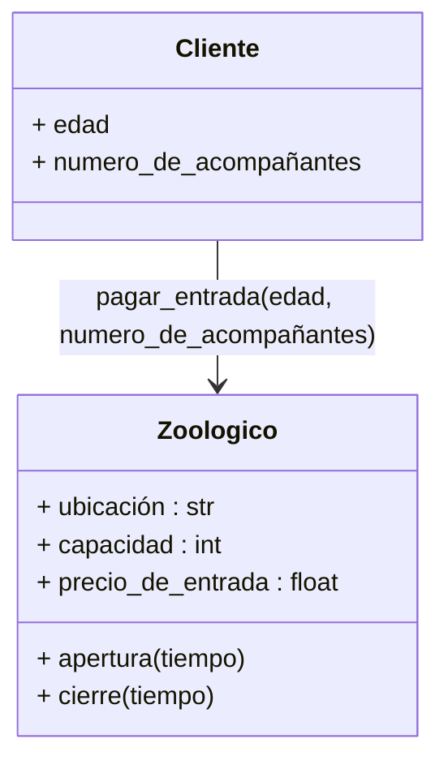
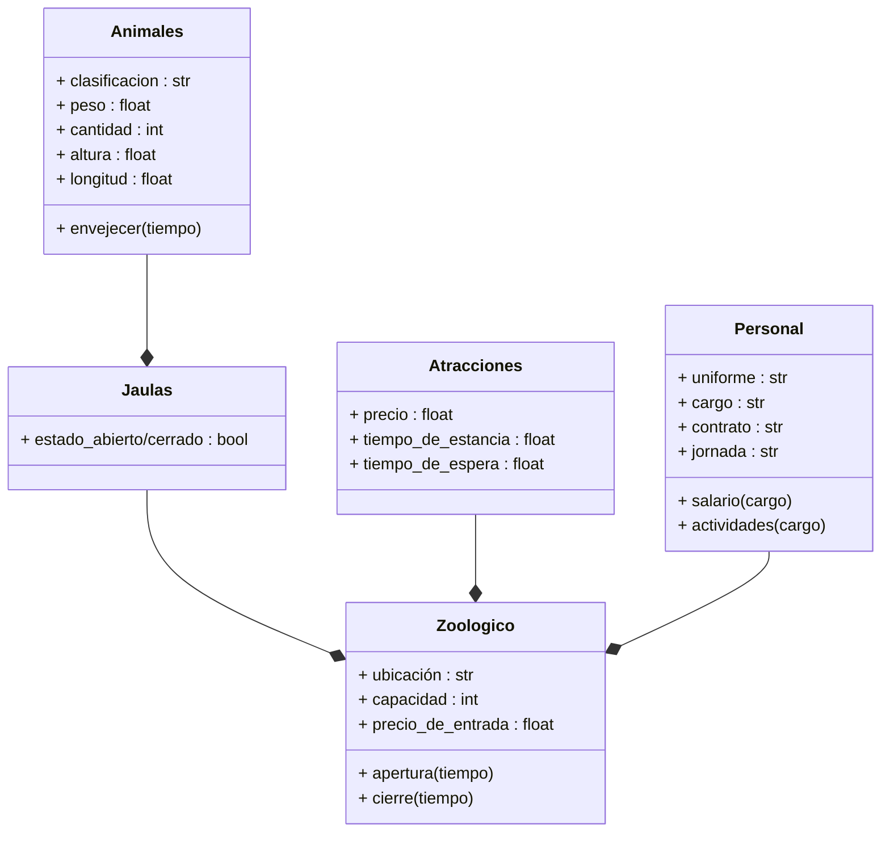
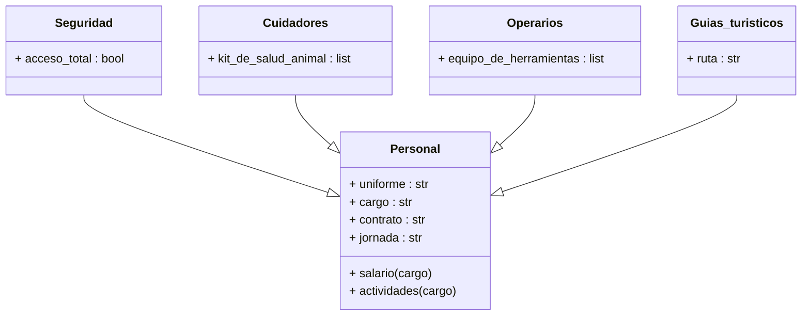
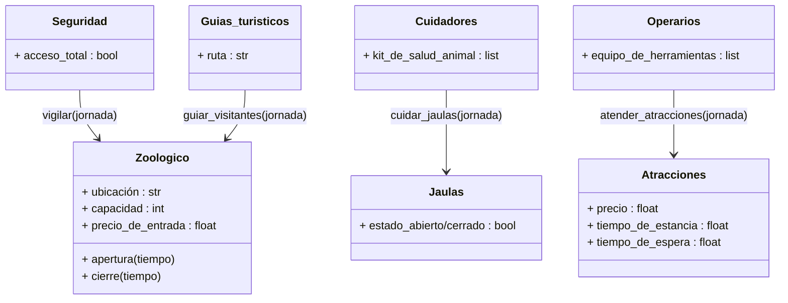

# poo_reto_2
### Soy Rafael Santiago Chirivi Peña y pertenezco al grupo de "Fenomenoides", adelante se muestra nuestro logo 

Preparense para ver el grandioso logo: 

<figure>  
<figcaption><b> "somos programadores, no diseñadores" </b></figcaption></figure>

 

Dando inicio al desarrollo de la materia, el primer acercamiento al tema fue el modelado en clases y objetos para una situacion de nuestra elección

## Caso de estudio: Zoologico
A partir de este caso, fueron modelados los siguientes diagramas de UML

### Relacion Zoologico - cliente

### Relacion Zoologico - Componentes

### Relacion entre personal

### Relacion personal - zoologico 

###
